# 27.3 USART 功能描述

本页单独整理英文参考手册 RM0008 Rev 17 的 `27.3 USART functional description`。中文参考手册版本较旧，对应章节为 `25.3 USART 功能概述`。

> 建议先学主线：`27.3.1` 帧格式 → `27.3.2` 发送 → `27.3.3` 接收 → `27.3.4` 波特率 → `27.3.5` 时钟误差 → `27.3.13` DMA → `27.3.14` 流控。`27.3.6`～`27.3.12` 是按需学习的特殊模式。

<details>
<summary><span style="color:#D9822B;">查看 USART 发送、接收数据路径与状态标志总览图</span></summary>

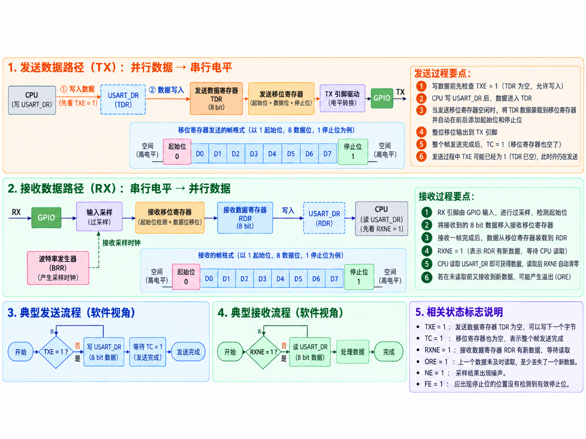

</details>

<details>
<summary>27.3 USART 功能总览</summary>

### 主要内容

- 普通双向 USART 通信至少使用 `RX` 和 `TX` 两个信号。
- `RX` 是串行数据输入（<span style="color:#D9822B;">Receive Data Input</span>），异步模式下通过过采样区分有效数据和噪声。

  <details>
  <summary><span style="color:#D9822B;">查看过采样的作用说明</span></summary>

  <span style="color:#D9822B;">USART 在一个 bit 周期内多次观察 RX，利用起始位检测、中心采样以及可能的多数判决，提高对短暂噪声和时钟误差的容忍能力。</span>

  </details>

- `TX` 是串行数据输出（<span style="color:#D9822B;">Transmit Data Output</span>）；发送器启用但没有数据时，`TX` 保持高电平。
- 普通数据帧包含空闲状态、起始位、8 位或 9 位数据以及停止位，数据按最低有效位优先（LSB first）传输。

  <details>
  <summary><span style="color:#D9822B;">查看 LSB first 传输示例</span></summary>

  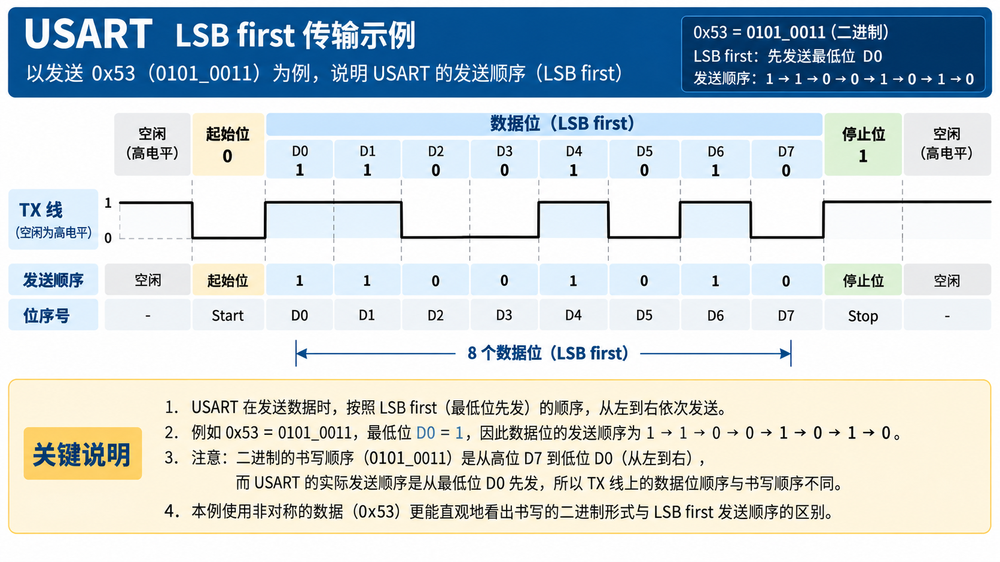

  </details>

- USART 使用带 12 位整数部分和 4 位小数部分的分数波特率发生器（<span style="color:#D9822B;">fractional baud rate generator</span>）。
- 同步模式增加 `CK` 时钟输出；硬件流控模式增加 `CTS` 和 `RTS`。
- Figure 278 展示了 `TDR`、发送移位寄存器、`RDR`、接收移位寄存器、波特率发生器、IrDA 和硬件流控模块之间的关系。详见 [Figure 278. USART block diagram讲解](Figure%20278.%20USART%20block%20diagram讲解.md)。

### 我的理解

`USART_DR` 是 CPU 看到的统一数据入口，但发送和接收在内部走两条独立通道：写操作进入 `TDR`，读操作来自 `RDR`。先记住这条数据流，再看后面的状态标志和配置位会容易很多。

### 参考位置

- 英文参考手册第 27 章，第 27.3 节，印刷页 788
- 中文参考手册对应第 25 章，第 25.3 节，印刷页 517

</details>

<details>
<summary>27.3.1 USART 字符描述</summary>

### 主要内容

- `USART_CR1.M` 选择 8 位或 9 位字长（<span style="color:#D9822B;">Word length</span>）。
- 起始位期间 `TX` 为低电平，停止位期间 `TX` 为高电平。
- 数据位按照 `Bit0`、`Bit1`……的顺序发送，即 LSB first。
- 空闲字符（<span style="color:#D9822B;">Idle character</span>）表现为一整帧逻辑 `1`，之后才是下一数据帧的起始位。
- Break 字符表现为持续一帧时间的逻辑 `0`；Break 结束后发送器插入 1 位或 2 位逻辑 `1`。
- 发送器和接收器共用波特率发生器，分别由 `TE` 和 `RE` 使能。
- Figure 279 对比了 8 位和 9 位字长，以及 Idle、Break 和下一数据帧的位置关系。

  <details>
  <summary><span style="color:#D9822B;">查看 Figure 279 字长设置与逐项讲解示意图</span></summary>

  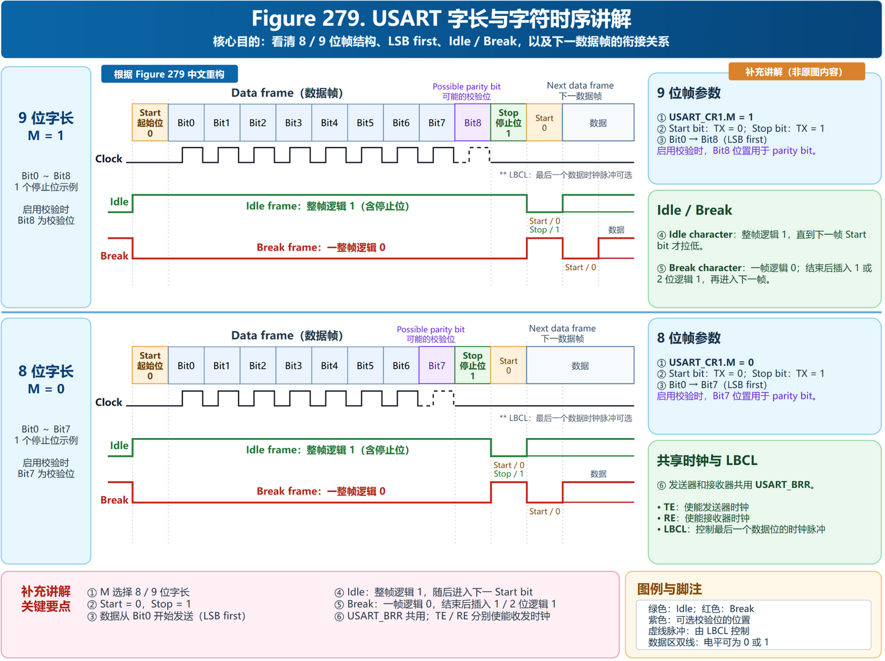

  </details>

### 我的理解

一帧不是只有数据位。以最常用的 `8N1` 为例，传送 8 位有效数据实际占用 10 个位时间：1 个起始位、8 个数据位和 1 个停止位。

### 参考位置

- 英文参考手册第 27 章，第 27.3.1 节，印刷页 791
- 中文参考手册对应第 25 章，第 25.3.1 节，印刷页 518

</details>

<details>
<summary>27.3.2 发送器</summary>

### Transmitter / 发送器

- 发送器可根据 `M` 位状态发送 8 位或 9 位数据字。
- `TE = 1` 后发送器启用，并先发送一个 Idle frame。

### Character transmission / 字符传输

- CPU 写 `USART_DR` 时，数据进入 `TDR`；硬件再把数据装入发送移位寄存器，从 `TX` 按 LSB first 输出。
- 每个字符前有 1 个低电平起始位，字符末尾由可配置数量的停止位结束。
- 传输期间不能清除 `TE`，否则波特率计数器冻结，当前发送数据会损坏。
- 写 `USART_DR` 会清除 `TXE`；数据从 `TDR` 移入发送移位寄存器后，硬件重新置位 `TXE`。
- `TXE = 1` 只表示可以写下一个数据；最后一帧完整结束由 `TC = 1` 表示。
- 关闭 USART 或进入低功耗模式前，必须等待最后一帧的 `TC = 1`。

### Configurable stop bits / 可配置停止位

- 停止位可配置为 `0.5`、`1`、`1.5` 或 `2` 个；普通 USART、单线和 Modem 模式使用 1 或 2 个停止位，`0.5` 和 `1.5` 个停止位用于 Smartcard 模式。

  <details>
  <summary><span style="color:#D9822B;">查看 Figure 280 可配置停止位示意图</span></summary>

  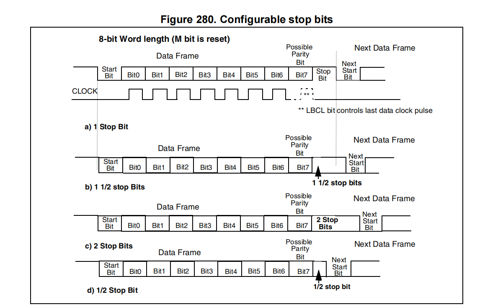

  图 280 以 8 位字长（`M` 位复位）为例，展示一个字符帧从起始位、数据位、可选校验位到停止位，再连接到下一数据帧的时序。

  - `a)` 1 个停止位：普通 USART 的默认配置。
  - `b)` 1.5 个停止位：用于 Smartcard 模式。
  - `c)` 2 个停止位：普通 USART、单线和 Modem 模式支持。
  - `d)` 0.5 个停止位：用于 Smartcard 接收。

  图中的 `Possible Parity Bit` 表示启用校验时，校验位位于最后一个数据位和停止位之间；停止位发送完成后，线路回到空闲状态，等待下一帧的起始位。

  </details>

### Procedure / 配置与发送流程

1. 向 `USART_CR1.UE` 写入 `1`，使能 USART。
2. 配置 `USART_CR1.M`，确定数据字长度。
3. 在 `USART_CR2` 中配置停止位数量。
4. 如果使用多缓冲通信，在 `USART_CR3` 中使能发送 DMA（`DMAT = 1`），并按多缓冲通信的要求配置 DMA 寄存器。
5. 使用 `USART_BRR` 配置所需的波特率。
6. 设置 `USART_CR1.TE = 1`，使能发送器；第一次发送会先发送一个 Idle frame。
7. 将待发送数据写入 `USART_DR`，该操作会清除 `TXE`；使用单缓冲模式时，对每个待发送数据重复此操作。
8. 写入最后一个数据后等待 `TC = 1`，这表示最后一帧已经发送完成；在关闭 USART 或进入 Halt 模式前必须执行此操作，以免损坏最后一次发送。

  <details style="margin-left:2em;">
  <summary><span style="color:#D9822B;">图：USART 配置与发送流程（Procedure）</span></summary>

  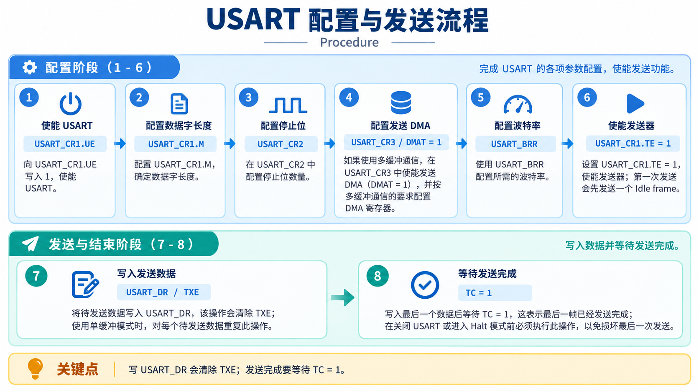

  </details>

### Single byte communication / 单字节通信

- 发送过程中，向 `USART_DR` 写入数据会把数据存入 `TDR`；当前发送完成后，`TDR` 中的数据会被复制到发送移位寄存器。
- 没有正在进行的发送时，写入 `USART_DR` 会直接把数据装入发送移位寄存器，发送立即开始，`TXE` 也会立即置位。
- `TXE` 会被硬件置位，表示数据已经从 `TDR` 移入发送移位寄存器、`TDR` 已为空，可以写入下一个数据而不会覆盖前一个数据。
- `TXE` 置位时，如果 `TXEIE = 1`，还可以产生发送数据寄存器空中断。
- 当一帧发送完毕且 `TXE = 1` 时，`TC` 置位；写入最后一个数据后，必须等待 `TC = 1`，再关闭 USART 或进入低功耗模式。
- `TC` 的标准清除顺序是先读取 `USART_SR`，再向 `USART_DR` 写入数据；多缓冲通信也可以直接向 `TC` 写入 `0` 清除它。

  <details style="margin-left:2em;">
  <summary><span style="color:#D9822B;">图：连续发送时 TXE 与 TC 的变化（Figure 281）</span></summary>

  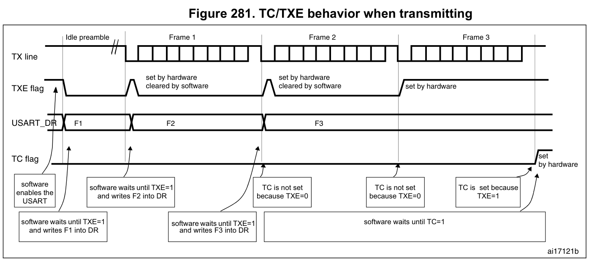

  <span style="color:#D9822B;">图中各信号的含义和变化过程如下：</span>

  - <span style="color:#D9822B;">`TX line`：USART 实际发送数据的线路。软件使能 USART 后，线路先发送 Idle preamble，随后依次发送 Frame 1、Frame 2 和 Frame 3。</span>
  - <span style="color:#D9822B;">`USART_DR`：软件把待发送数据写入这里；硬件先将其放入 `TDR`，再复制到发送移位寄存器。图中的 `F1`、`F2`、`F3` 表示连续写入的三帧数据。</span>
  - <span style="color:#D9822B;">`TXE` 初始为 `1`，表示 `TDR` 为空，可以写入第一帧。软件写入 `F1` 后，`TDR` 被占用，因此 `TXE` 变为 `0`；当硬件把 `TDR` 中的 `F1` 移入发送移位寄存器、发送开始后，`TDR` 又变为空，硬件将 `TXE` 置为 `1`，软件此时可以写入 `F2`。后续写入 `F2`、`F3` 时会重复这一过程；最后一帧移入发送移位寄存器后，`TXE` 保持为 `1`。</span>
  - <span style="color:#D9822B;">`TC` 初始为 `0`，因为发送过程尚未完成。发送 `F1` 结束时，如果 `F2` 已经写在 `TDR` 中，`TXE = 0`，所以 `TC` 不会置位；发送 `F2` 结束时同理，`F3` 仍在等待发送，`TC` 仍为 `0`。只有 `F3` 也发送完毕，同时 `TDR` 已空、`TXE = 1` 时，`TC` 才在最后拉高，表示最后一帧已经真正离开 `TX` 线路。</span>
  - <span style="color:#D9822B;">因此，发送最后一帧后必须等待 `TC = 1`，再关闭 USART 或让微控制器进入低功耗模式；只检查 `TXE = 1` 只能说明 `TDR` 空了，不能保证最后一帧已经发送完成。</span>

  </details>

### Break characters / Break 字符

- 设置 `SBK = 1` 后，USART 会在当前字符发送完成后，通过 `TX` 发送 Break 字符。
- Break 帧的长度取决于 `M` 位；Break 完成时（Break 字符的停止位期间），硬件会清除 `SBK`。
- 最后一个 Break 帧结束时，USART 会插入一个逻辑 `1`，确保接收端能够识别下一帧的起始位。
- 如果在 Break 开始前由软件清除 `SBK`，则不会发送 Break；连续发送两个 Break 时，应在前一个 Break 的停止位之后再设置 `SBK`。

  <details style="margin-left:2em;">
  <summary><span style="color:#D9822B;">查看 USART 发送 Break（SBK）时序示意图</span></summary>

  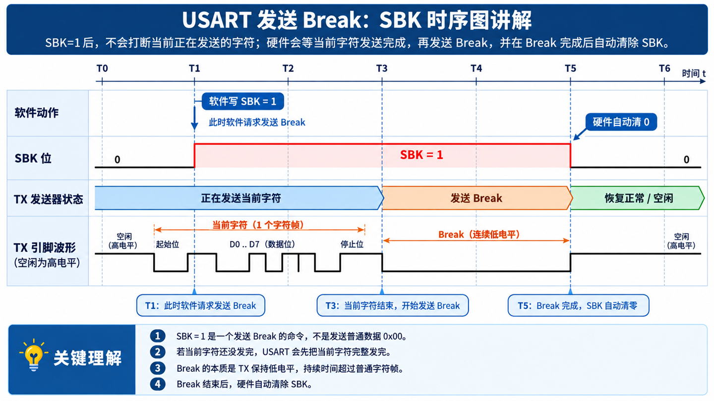

  </details>

### Idle characters / Idle 字符

- 设置 `TE = 1` 后，USART 会在第一个数据帧之前先发送一个 Idle frame。
- Idle frame 表现为发送线保持逻辑 `1` 的完整帧时间，随后才开始发送第一个数据帧。

### 我的理解

连续发送时主要看 `TXE`，因为它决定能否安全地写下一个数据；真正结束通信时看 `TC`。把 `TXE` 理解为“邮箱空了”，把 `TC` 理解为“快递已经送完”。

### 参考位置

- 英文参考手册第 27 章，第 27.3.2 节，印刷页 792
- 中文参考手册对应第 25 章，第 25.3.2 节，印刷页 519

</details>

<details>
<summary>27.3.3 接收器</summary>

### Receiver / 接收器

USART 可以接收 8 位或 9 位的数据字，具体长度取决于 `USART_CR1` 寄存器中的 `M` 位。

### Start bit detection / 起始位检测

USART 在识别到特定的采样序列时检测起始位。该序列为 `1 1 1 0 X 0 X 0 X 0 0 0 0`。

[Figure 282：起始位检测（含原图与讲解图）](Figure%20282.%20Start%20bit%20detection讲解.md)。

注意：如果该序列不完整，起始位检测会中止；接收器返回空闲状态，等待下一次下降沿，不设置标志。

- 如果第 3、5、7 个采样点全为 `0`，且第 8、9、10 个采样点也全为 `0`，起始位得到确认。原文注明此时设置 `RXNE`，并在 `RXNEIE = 1` 时产生中断。
- 如果上述两组三点采样各有至少两个采样值为 `0`，起始位仍有效；但只要某组不是三个 `0`，就设置噪声标志 `NE`。原文同样注明设置 `RXNE`，并在 `RXNEIE = 1` 时产生中断。
- 如果两组采样中有一组不满足“至少两个为 `0`”，起始位检测中止；接收器返回空闲状态，不设置标志。

### Character reception / 字符接收

USART 接收时，数据通过 `RX` 引脚按最低有效位优先，即 LSB (Least Significant Bit) first 的顺序移入。在这种模式下，`USART_DR` 寄存器包含一个缓冲区 `RDR`，位于内部总线与接收移位寄存器之间。

配置步骤（Procedure）：

1. 将 `USART_CR1` 寄存器中的 `UE` 位置为 `1`，使能 USART。
2. 配置 `USART_CR1` 中的 `M` 位，确定字长。
3. 在 `USART_CR2` 中配置停止位的数量。
4. 如果使用多缓冲通信，在 `USART_CR3` 中使能接收 DMA（`DMAR`），并按照多缓冲通信的说明配置 DMA 寄存器。原文在此步骤末附有 `STEP 3`。
5. 通过波特率寄存器 `USART_BRR` 选择所需的波特率。
6. 设置 `USART_CR1` 中的 `RE` 位，使能接收器；接收器随即开始寻找起始位。

接收到一个字符时：

- `RXNE` 位置位，表示接收移位寄存器中的内容已经转移到 `RDR`。换句话说，数据已经收到，可以连同相关错误标志一起读取。
- 如果设置了 `RXNEIE` 位，则产生中断。
- 如果接收过程中检测到帧错误、噪声或溢出，相关错误标志可能置位。
- 在多缓冲模式下，每接收一个字节都会置位 `RXNE`；DMA 读取数据寄存器后清除 `RXNE`。
- 在单缓冲模式下，软件读取 `USART_DR` 寄存器会清除 `RXNE`；向 `RXNE` 写入 `0` 也可以清除该标志。为了避免溢出，必须在下一字符接收结束之前清除 `RXNE`。

注意：接收数据期间不应清除 `RE` 位。如果在接收期间禁用 `RE`，当前字节的接收会中止。

### Break character / Break 字符

接收到 Break 字符时，USART 将其按帧错误处理。

### Idle character / 空闲字符

检测到 Idle frame 时，USART 执行与接收到数据字符相同的处理；如果设置了 `IDLEIE` 位，还会产生中断。

### Overrun error / 溢出错误

如果接收新字符时 `RXNE` 尚未清除，就会发生溢出。清除 `RXNE` 之前，数据不能从接收移位寄存器转移到 `RDR`。

每接收一个字节，`RXNE` 都会置位。如果接收下一份数据时 `RXNE` 仍然置位，或者上一次 DMA 请求尚未得到处理（<span style="color:#D9822B;">or the previous DMA request has not been serviced</span>），也会发生溢出。发生溢出时：

- `ORE` 位置位。
- `RDR` 中原有内容不会丢失；读取 `USART_DR` 时仍能取得先前的数据。
- 接收移位寄存器会被覆盖；从此时起，在溢出期间收到的数据会丢失。
- 如果设置了 `RXNEIE`，或者同时设置了 `EIE` 和 `DMAR`，则产生中断。
- 先读取 `USART_SR`，再读取 `USART_DR`，可以清除 `ORE`。

注意：`ORE` 置位表示至少丢失了一份数据，可能出现以下两种情况：

- `RXNE = 1`：最后一份有效数据仍存放在 `RDR` 中，可以读取。
- `RXNE = 0`：最后一份有效数据已经读取，`RDR` 中没有可读数据。如果读取这份有效数据的同时收到新数据（而新数据丢失），就可能出现这种情况；新数据也可能在先读 `USART_SR`、后读 `USART_DR` 的清除序列之间到达。

  <details>
  <summary><span style="color:#D9822B;">查看 USART 接收溢出错误 ORE 说明图</span></summary>

  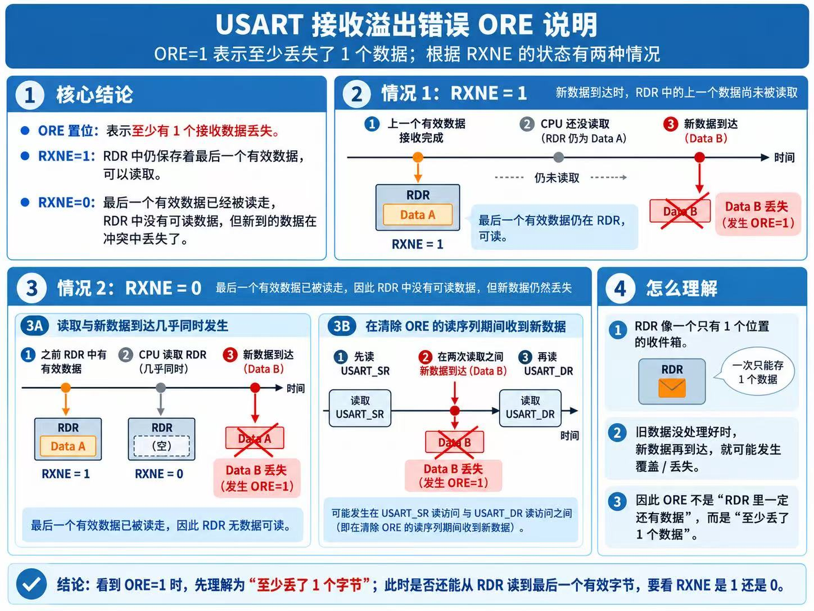

  </details>

### Noise error / 噪声错误

除了同步模式，USART 使用过采样技术恢复数据，以区分有效输入数据和噪声（<span style="color:#D9822B;">discriminating between valid incoming data and noise</span>）。

- Figure 283 展示了用于噪声检测的数据采样。

  <details>
  <summary><span style="color:#D9822B;">查看 Figure 283 数据采样示意图</span></summary>

  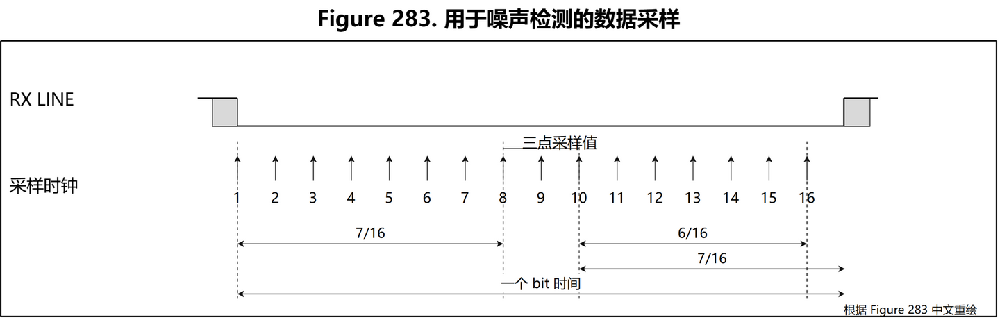

  </details>

- Table 191 列出了全部三点采样值、`NE` 状态、接收位值及数据有效性。

  <details>
  <summary><span style="color:#D9822B;">查看 Table 191 噪声检测表</span></summary>

  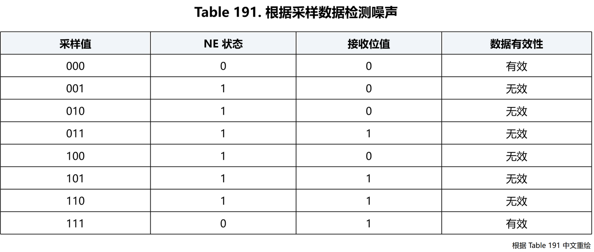

  </details>

在一帧中检测到噪声时：

- `NE` 在 `RXNE` 置位的上升沿置位。
- 无效数据仍会从接收移位寄存器转移到 `USART_DR` 寄存器。
- 单字节通信时，`NE` 本身不产生中断；但它与 `RXNE` 同时置位，而 `RXNE` 本身可以产生中断。多缓冲通信时，如果 `USART_CR3` 中的 `EIE` 位置位，则产生中断。

先读取 `USART_SR`，再读取 `USART_DR`，可以清除 `NE`。

### Framing error / 帧错误

如果接收时未在预期时刻识别到停止位，就会检测到帧错误；原因可能是同步失准或噪声过大（<span style="color:#D9822B;">The stop bit is not recognized on reception at the expected time, following either a de-synchronization or excessive noise.</span>）。

<details>
<summary><span style="color:#D9822B;">查看 USART 噪声错误 NE 检测总结图</span></summary>

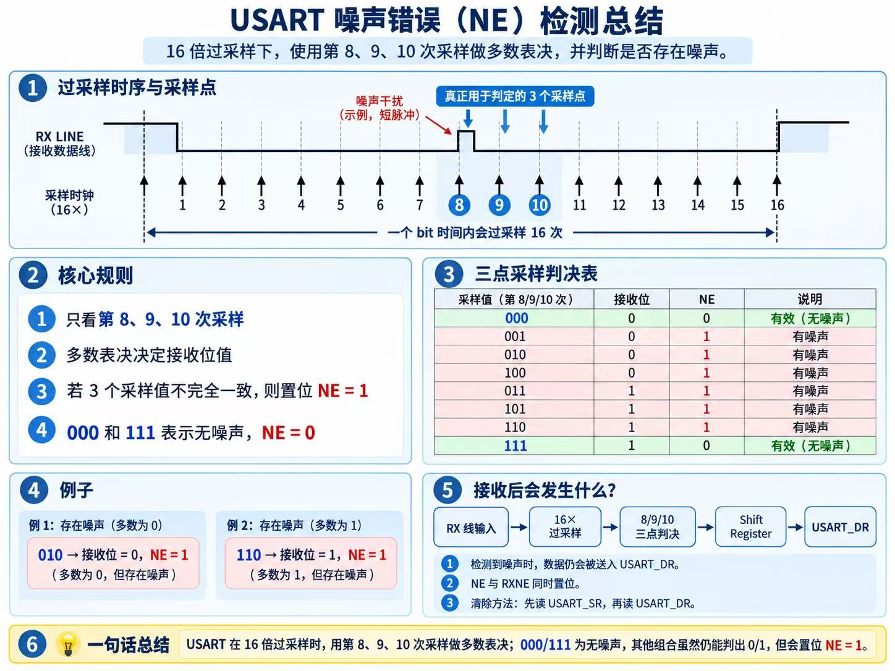

</details>

检测到帧错误时：

- 硬件置位 `FE`。
- 无效数据仍会从接收移位寄存器转移到 `USART_DR` 寄存器。
- 单字节通信时，`FE` 本身不产生中断；但它与 `RXNE` 同时置位，而 `RXNE` 本身可以产生中断。多缓冲通信时，如果 `USART_CR3` 中的 `EIE` 位置位，则产生中断。

先读取 `USART_SR`，再读取 `USART_DR`，可以清除 `FE`。

### Configurable stop bits during reception / 接收期间的可配置停止位

通过控制寄存器 2 中的控制位，可以配置接收的停止位数量：普通模式可为 1 或 2 个；Smartcard 模式可为 0.5 或 1.5 个。

1. **0.5 个停止位（Smartcard 接收）**：不对这半个停止位采样。因此选择 0.5 个停止位时，无法检测帧错误或 Break 帧。

   <details>
   <summary><span style="color:#D9822B;">图：0.5 个停止位（Smartcard 模式接收）说明</span></summary>

   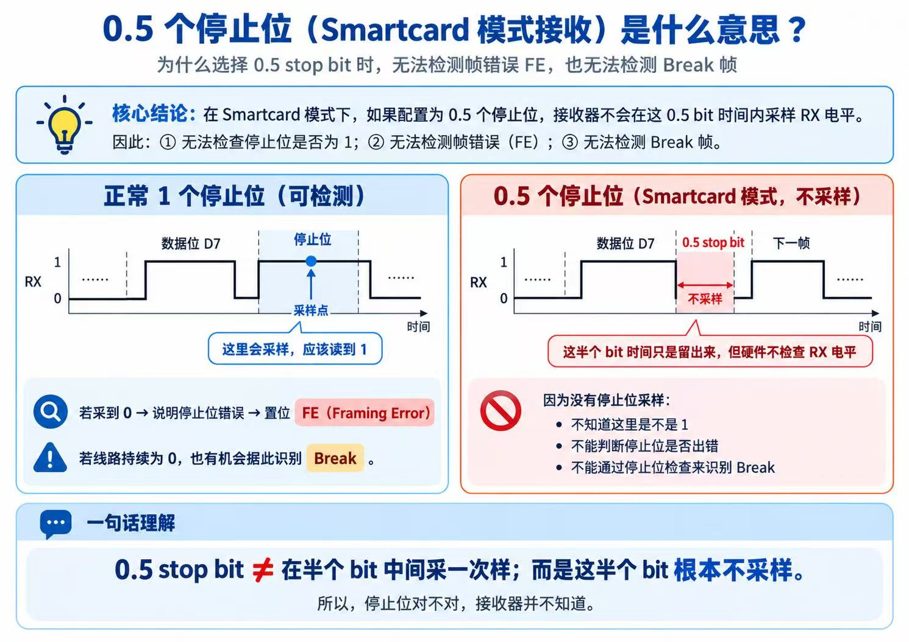

   </details>

2. **1 个停止位**：在第 8、9、10 个采样点对停止位采样。
3. **1.5 个停止位（Smartcard 模式）**：Smartcard 发送时，设备必须检查数据是否正确发送，所以接收模块也必须使能（`USART_CR1.RE = 1`）。接收器检查停止位，以判断 Smartcard 是否检测到奇偶校验错误。如果出现奇偶校验错误，Smartcard 会在采样期间把数据线拉低，作为 `NACK` 信号；USART 将其标记为帧错误。到 1.5 个停止位结束时，`FE` 与 `RXNE` 一起置位。采样发生在第 16、17、18 个采样点，即停止位开始后经过一个波特率时钟周期。1.5 个停止位可以分为两部分：前 0.5 个波特率时钟周期不进行处理，随后一个正常停止位周期在其中部采样。更多细节见第 27.3.11 节。

   > **备注：** 这是 Smartcard 专用场景，普通 UART 学习和使用时不重要，可以跳过不看。
4. **2 个停止位**：在第一个停止位的第 8、9、10 个采样点采样。如果第一个停止位出现帧错误，就置位 `FE`；第二个停止位不检查帧错误。`RXNE` 在第一个停止位结束时置位。

### 参考位置

- 英文参考手册第 27 章，第 27.3.3 节，印刷页 795～799
- 中文参考手册对应第 25 章，第 25.3.3 节，印刷页 521～524

</details>

<details>
<summary>27.3.4 分数波特率的产生</summary>

### 主要内容

- 发送和接收使用同一个 `USARTDIV` 值。
- `USARTDIV` 是无符号定点数，编码在 `USART_BRR` 中：高 12 位为整数部分，低 4 位为小数部分。
- 波特率公式为 `Baud = fCK / (16 × USARTDIV)`。
- `USARTDIV = DIV_Mantissa + DIV_Fraction / 16`。
- 小数部分需要四舍五入；如果结果为 16，要向整数部分进位并把小数部分置 0。
- 写入 `USART_BRR` 后波特率计数器会更新，因此通信过程中不应修改 `USART_BRR`。
- USART1 使用 `PCLK2`；其他 USART 使用 `PCLK1`。
- Table 192 给出了 36 MHz 和 72 MHz 外设时钟下常用波特率的实际值与误差。

```text
以 USART1、PCLK2 = 72 MHz、目标 115200 bit/s 为例：

USARTDIV = 72,000,000 ÷ (16 × 115,200) = 39.0625
DIV_Mantissa = 39 = 0x27
DIV_Fraction = 0.0625 × 16 = 1
USART_BRR = 0x271
```

### 我的理解

算波特率时先确认 USART 挂在哪条 APB 总线上，再代入公式。小数部分只有 4 位，因此最终波特率可能存在量化误差，不能只看目标值而忽略实际值。

### 参考位置

- 英文参考手册第 27 章，第 27.3.4 节，印刷页 799
- 中文参考手册对应第 25 章，第 25.3.4 节，印刷页 524

</details>

<details>
<summary>27.3.5 USART 接收器对时钟偏差的容忍度</summary>

### 主要内容

- 异步接收正常工作的前提是系统总时钟偏差小于接收器容忍度（<span style="color:#D9822B;">USART receiver tolerance</span>）。
- 总偏差包含发送端误差 `DTRA`、接收端波特率量化误差 `DQUANT`、接收端振荡器误差 `DREC` 和传输线路误差 `DTCL`。
- 必须满足：`DTRA + DQUANT + DREC + DTCL < USART receiver tolerance`。
- 容忍度与 10/11 位字符长度、是否使用分数波特率，以及是否把噪声标志视为错误有关。
- Table 193 和 Table 194 给出的容忍度约为 `3.03%`～`4.375%`，具体取决于配置。

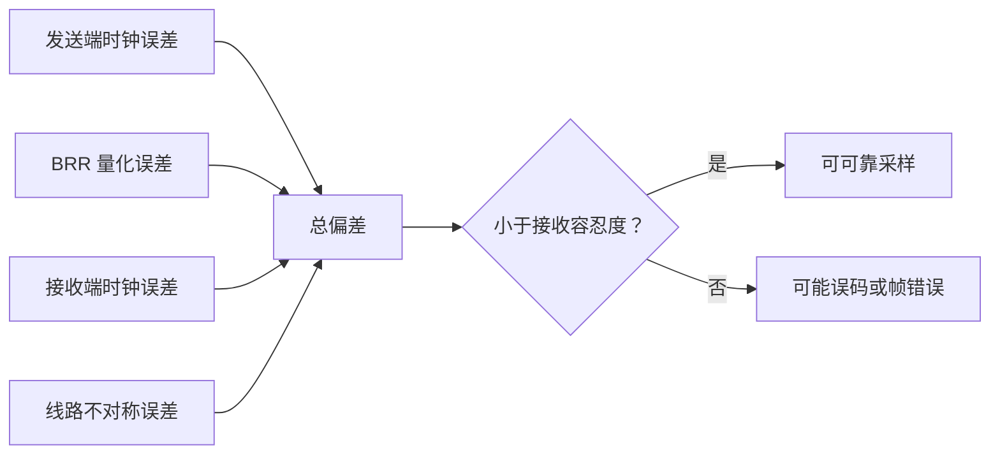

### 我的理解

收发双方都设置为 `115200` 并不代表物理波特率完全相同。晶振误差、BRR 舍入和收发器延迟会叠加；总偏差过大时，越靠后的数据位采样点偏移越明显。

### 参考位置

- 英文参考手册第 27 章，第 27.3.5 节，印刷页 801
- 中文参考手册对应第 25 章，第 25.3.5 节，印刷页 525

</details>

<details>
<summary>27.3.6 多处理器通信</summary>

### 主要内容

- 多个 USART 可以组成主从网络，非目标从机可进入静默模式（<span style="color:#D9822B;">mute mode</span>），以减少无关接收中断。
- 静默模式中，接收状态位不会置位，接收中断被禁止，`RWU = 1`。
- `WAKE = 0` 时使用 Idle line 唤醒；检测到 Idle frame 后硬件清除 `RWU`。
- `WAKE = 1` 时使用 Address Mark 唤醒；最高位为 `1` 的字节被视为地址，最低 4 位与 `USART_CR2.ADD` 比较。
- 地址不匹配时进入静默模式；地址匹配时退出静默模式并恢复正常接收。
- Figure 284 和 Figure 285 分别展示 Idle line 与 Address Mark 唤醒过程。

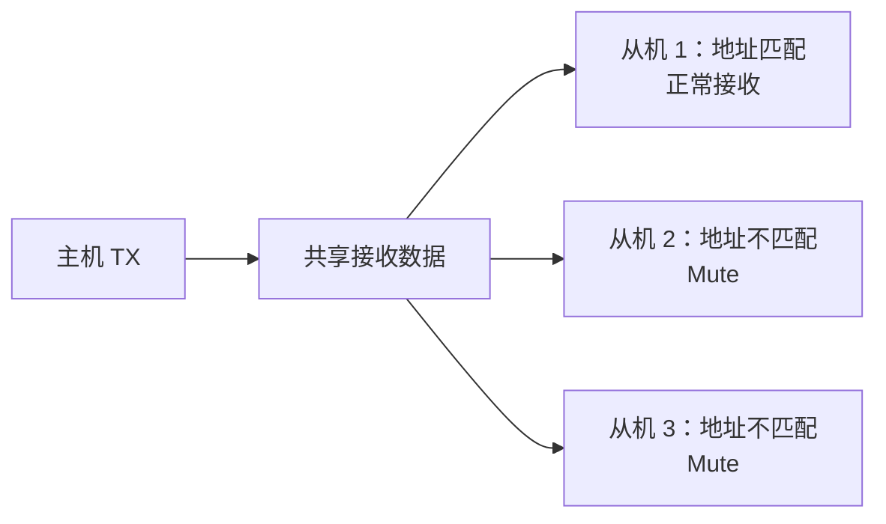

### 我的理解

这个模式解决的是“一条串行链路上有多个接收者”时的 CPU 负担问题。不是自己的消息时，从机保持静默；看到自己的地址后才开始处理后续数据。

### 参考位置

- 英文参考手册第 27 章，第 27.3.6 节，印刷页 801
- 中文参考手册对应第 25 章，第 25.3.6 节，印刷页 526

</details>

<details>
<summary>27.3.7 奇偶校验控制</summary>

### 主要内容

- `PCE = 1` 开启奇偶校验位的发送和接收检查（<span style="color:#D9822B;">Parity control</span>）。
- `PS = 0` 选择偶校验，`PS = 1` 选择奇校验。
- 开启校验后，原字长的最高位被校验位占用，因此有效数据位数会减少 1 位。
- 接收校验失败时置位 `PE`；`PEIE = 1` 时产生中断。
- Table 195 给出的帧组合如下。

| `M` | `PCE` | 帧中的有效内容 |
| --- | --- | --- |
| `0` | `0` | 起始位 + 8 位数据 + 停止位 |
| `0` | `1` | 起始位 + 7 位数据 + 校验位 + 停止位 |
| `1` | `0` | 起始位 + 9 位数据 + 停止位 |
| `1` | `1` | 起始位 + 8 位数据 + 校验位 + 停止位 |

### 我的理解

STM32F1 的 `M` 定义的是“数据字段总宽度”，其中可能包含校验位。想得到常说的“8 数据位 + 1 校验位”，需要设置 `M = 1` 和 `PCE = 1`。

### 参考位置

- 英文参考手册第 27 章，第 27.3.7 节，印刷页 803
- 中文参考手册对应第 25 章，第 25.3.7 节，印刷页 527

</details>

<details>
<summary>27.3.8 LIN 模式</summary>

### 主要内容

- `USART_CR2.LINEN = 1` 选择 LIN 模式。
- LIN 模式要求清除 `STOP[1:0]`、`CLKEN`、`SCEN`、`HDSEL` 和 `IREN`。
- LIN 主机发送使用 8 位字长，即 `M = 0`。
- LIN 模式下设置 `SBK` 会发送 13 个逻辑 `0`，随后发送 1 个逻辑 `1` 作为分隔符。
- 接收端可配置检测连续 10 位或 11 位低电平；随后检测到分隔符时置位 `LBD`。
- `LBDIE = 1` 时，检测到 LIN Break 会产生中断。
- Figure 286 展示不同长度 Break 的判定；Figure 287 对比 LIN Break 与普通帧错误。

```text
LIN Break： 0 0 0 0 0 0 0 0 0 0 0 0 0 | 1
            <------ 13 位低电平 ------>  分隔符
```

### 我的理解

LIN 的关键不是普通数据字节，而是帧头中的长低电平 Break。USART 内置专门的 Break 检测逻辑，因此不必完全依靠软件计算低电平持续时间。

### 参考位置

- 英文参考手册第 27 章，第 27.3.8 节，印刷页 804
- 中文参考手册对应第 25 章，第 25.3.8 节，印刷页 528

</details>

<details>
<summary>27.3.9 USART 同步模式</summary>

### 主要内容

- `USART_CR2.CLKEN = 1` 选择同步模式。
- 同步模式要求清除 `LINEN`、`SCEN`、`HDSEL` 和 `IREN`。
- `CK` 是发送时钟输出；起始位和停止位期间不输出时钟脉冲。
- `CPOL` 选择时钟极性，`CPHA` 选择时钟相位，`LBCL` 决定最后一个有效数据位是否输出时钟。
- 同步接收依据 `CK` 边沿采样，不使用异步模式的过采样。
- `CK` 只在发送器启用且有数据发送时产生，因此不能在完全不发送数据的情况下单独接收同步数据。
- 该 USART 同步模式只支持主机模式，`CK` 始终是输出。
- `LBCL`、`CPOL`、`CPHA` 应在 `TE = 0` 且 `RE = 0` 时配置。
- Figure 288～Figure 291 展示连接方式、8/9 位时钟时序和建立/保持时间。

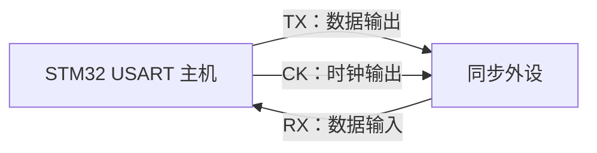

### 我的理解

它看起来像 SPI 主机，但仍保留 USART 的起始位、停止位和帧结构，不能直接把它等同于完整 SPI 控制器。

### 参考位置

- 英文参考手册第 27 章，第 27.3.9 节，印刷页 806
- 中文参考手册对应第 25 章，第 25.3.9 节，印刷页 530

</details>

<details>
<summary>27.3.10 单线半双工通信</summary>

### 主要内容

- `USART_CR3.HDSEL = 1` 选择单线半双工模式。
- 该模式要求清除 `LINEN`、`CLKEN`、`SCEN` 和 `IREN`。
- `TX` 与内部接收通道连接，外部 `RX` 引脚不再使用。
- USART 不发送时会释放 `TX`，因此该引脚应配置为浮空输入或高电平开漏输出。
- 线路冲突必须由软件管理；硬件不会因为检测到冲突而自动阻止发送。


### 我的理解

“单线”表示收发共用一根线，“半双工”表示同一时刻只能有一方发送。软件必须规定谁在什么时候拥有总线，否则两端同时驱动会发生冲突。

### 参考位置

- 英文参考手册第 27 章，第 27.3.10 节，印刷页 808
- 中文参考手册对应第 25 章，第 25.3.10 节，印刷页 532

</details>

<details>
<summary>27.3.11 Smartcard 模式</summary>

### 主要内容

- `USART_CR3.SCEN = 1` 选择 Smartcard 模式，并要求清除 `LINEN`、`HDSEL` 和 `IREN`。
- 该模式面向 ISO 7816-3 异步智能卡协议。
- 推荐配置为 `M = 1`、`PCE = 1`，即 8 位有效数据加校验位，并使用 `1.5` 个停止位。
- Smartcard 使用单线半双工通信，`TX` 连接双向数据线并配置为开漏输出。
- 接收方检测到校验错误时可以在停止位期间把线路拉低，形成 NACK；发送方将其检测为帧错误。
- `USART_GTPR.GT` 配置保护时间，保护时间计数结束后才置位 `TC`。
- `CK` 可向智能卡提供独立时钟，分频范围为外设输入时钟的 `/2`～`/62`。
- Smartcard 模式不使用普通 USART 的 Idle frame 和 Break 语义。
- Figure 292 展示有无校验错误时的数据线；Figure 293 展示 1.5 停止位中的 NACK 采样。

### 我的理解

Smartcard 模式把奇偶校验、单线半双工、NACK、保护时间和卡时钟组合在一起。它不是普通 `8N1` 串口配置，重点是按 ISO 7816-3 的时序协同工作。

### 参考位置

- 英文参考手册第 27 章，第 27.3.11 节，印刷页 809
- 中文参考手册对应第 25 章，第 25.3.11 节，印刷页 532

</details>

<details>
<summary>27.3.12 IrDA SIR 编解码模块</summary>

### 主要内容

- `USART_CR3.IREN = 1` 选择 IrDA 模式，并要求清除与 LIN、同步、Smartcard 和单线模式相关的互斥配置位。
- IrDA SIR 使用 RZI 调制，逻辑 `0` 表现为红外脉冲，逻辑 `1` 不产生脉冲。
- 普通模式下脉冲宽度为一个位周期的 `3/16`。
- SIR 编码器把 USART 的 NRZ 数据变成 IrDA 脉冲；解码器执行反向转换。
- SIR ENDEC 支持的最高波特率为 `115.2 Kbit/s`。
- IrDA 是半双工协议；接收期间应避免发送，发送期间接收数据会被忽略。
- IrDA 模式必须配置为 1 个停止位。
- `USART_GTPR.PSC` 用于低功耗模式的脉冲和毛刺检测计时，`PSC = 0` 时编解码器不能工作。
- IrDA 规范要求发送与接收之间至少留出 `10 ms`，该切换时间由软件管理。
- Figure 294 展示 SIR ENDEC 数据通路；Figure 295 展示 `3/16` 脉冲调制。

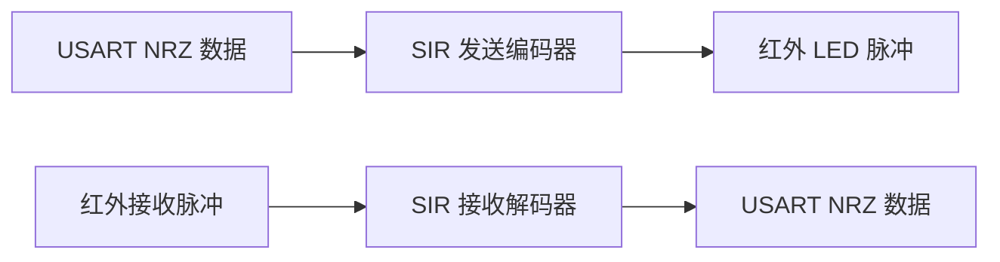

### 我的理解

USART 负责字节和帧，IrDA 模块只负责把普通串口位流变成适合红外链路的短脉冲。它仍然是半双工，收发方向切换必须留出协议要求的时间。

### 参考位置

- 英文参考手册第 27 章，第 27.3.12 节，印刷页 811
- 中文参考手册对应第 25 章，第 25.3.12 节，印刷页 533

</details>

<details>
<summary>27.3.13 使用 DMA 连续通信</summary>

### 主要内容

- USART 可分别产生发送和接收 DMA 请求。
- `USART_CR3.DMAT = 1` 开启发送 DMA；每次 `TXE` 事件触发 DMA 将数据从 SRAM 写入 `USART_DR`。
- `USART_CR3.DMAR = 1` 开启接收 DMA；每次 `RXNE` 事件触发 DMA 将 `USART_DR` 中的数据搬到 SRAM。
- DMA 需要配置外设地址、存储器地址、传输数量、通道优先级以及半传输/全传输中断。
- DMA 发送完成标志只表示所有数据已经写入 USART，不表示最后一帧已经离开 `TX`。
- DMA 发送结束后仍必须等待 USART 的 `TC = 1`，才能关闭 USART 或进入 Stop 模式。
- DMA 接收时，DMA 读取 `USART_DR` 会清除 `RXNE`。
- 多缓冲通信中的 `NE`、`ORE`、`FE` 可由 `USART_CR3.EIE` 控制错误中断。
- Figure 296 和 Figure 297 分别展示 DMA 发送与接收过程中状态标志的变化。

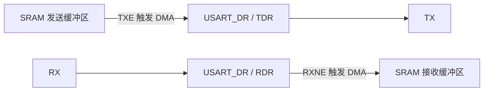

### 我的理解

DMA 替 CPU 搬运数据，但不会改变 USART 的物理发送过程。`DMA TCIF = 1` 是“内存搬完”，`USART TC = 1` 才是“线路发完”，这是最容易混淆的地方。

### 参考位置

- 英文参考手册第 27 章，第 27.3.13 节，印刷页 813
- 中文参考手册对应第 25 章，第 25.3.13 节，印刷页 535

</details>

<details>
<summary>27.3.14 硬件流控制</summary>

### 主要内容

- USART 使用 `CTS` 输入和 `RTS` 输出控制两个设备间的数据流。
- `RTSE = 1` 和 `CTSE = 1` 可分别独立启用 RTS 与 CTS 流控。
- `RTS` 为低电平时表示接收器还能接收数据；接收寄存器满时，RTS 释放为高电平，要求对方在当前帧结束后暂停。
- `CTS` 为低电平时允许发送下一帧；CTS 变为高电平时，当前帧继续完成，但下一帧被延迟。
- `CTSE = 1` 时，CTS 输入变化会置位 `CTSIF`；`CTSIE = 1` 时产生中断。
- Figure 298 展示两个 USART 的交叉连接；Figure 299 和 Figure 300 分别展示 RTS 与 CTS 对数据流的影响。

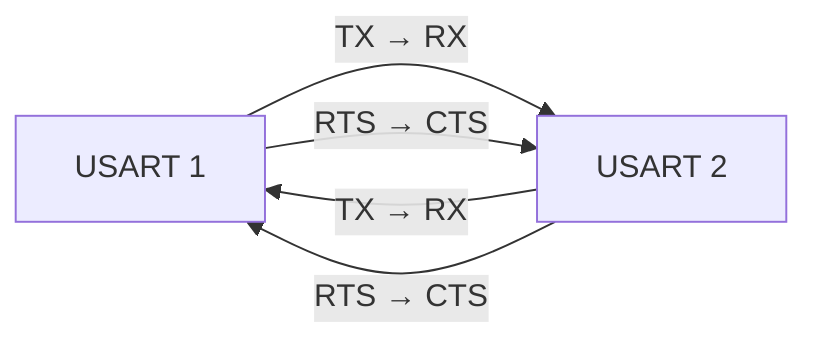

### 我的理解

RTS 表达“我能不能继续接收”，CTS 表达“对方是否允许我继续发送”。两者都是低电平有效，并且不会截断已经开始发送的当前帧。

### 参考位置

- 英文参考手册第 27 章，第 27.3.14 节，印刷页 816
- 中文参考手册对应第 25 章，第 25.3.14 节，印刷页 537

</details>

<details>
<summary>学习问题：普通串口最应该掌握哪些内容？</summary>

如果目标是完成常见的串口打印、模块通信或上位机通信，优先掌握下面这条路径：

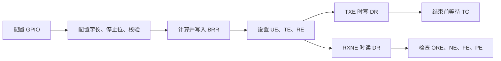

- 第一阶段：掌握 `27.3.1`～`27.3.5`。
- 第二阶段：掌握中断、DMA 和 `TXE`、`TC`、`RXNE` 的区别。
- 第三阶段：实际项目需要时再学习 LIN、同步、单线、Smartcard、IrDA 和硬件流控。

</details>
