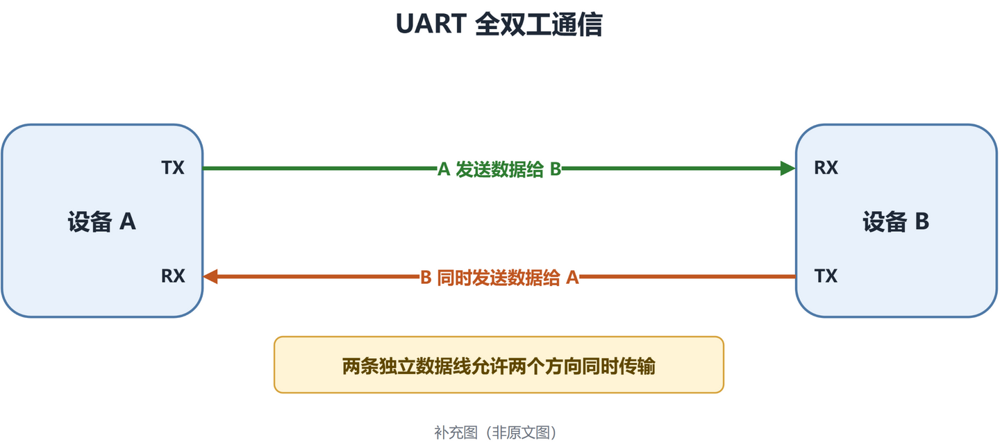
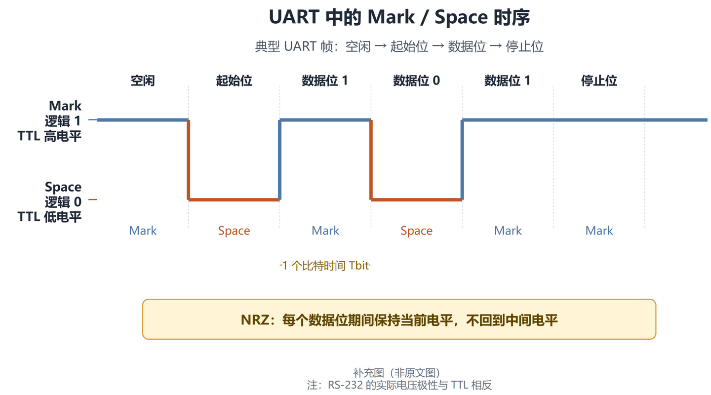

# UART / USART 学习笔记

27.1 USART 简介

USART（通用同步/异步收发器）用于与外部设备进行串行数据通信。

### 主要内容

- 支持全双工数据交换（full-duplex data exchange），可以同时发送和接收数据（simultaneously sending and receiving data）。
- 异步通信（asynchronous communication）采用工业标准 NRZ 数据格式。
- 使用分数波特率发生器（fractional baud rate generator），支持较宽范围的波特率（a very wide range of baud rates）。
- 支持同步单向通信（synchronous one-way communication）。
- 支持单线半双工通信（half-duplex single wire communication）。
- 支持 LIN（局部互联网络）协议。
- 支持智能卡协议。
- 支持 IrDA 红外通信规范。
- 支持调制解调器的 CTS/RTS 硬件流控制。
- 支持多处理器通信。
- 配合 DMA 多缓冲配置（DMA multibuffer configuration），可以实现高速数据通信（high speed data communication is possible）。

### 我的理解

27.1 主要介绍 USART 的功能和应用范围，没有展开讲具体寄存器配置。最常用的场景是通过 TX 和 RX 与电脑、其他单片机或传感器模块进行异步串口通信。

### 参考位置

- 英文参考手册第 27 章，第 27.1 节，印刷页 786
- 中文参考手册对应第 25 章，第 25.1 节，印刷页 516

27.2 USART 主要特性

### 主要内容

- 支持全双工异步通信（Full duplex, asynchronous communications）。

  

  
查看全双工异步通信示意图

  

  

- 使用 NRZ 标准格式（NRZ standard format），包含 Mark/Space 电平。
- 支持分数波特率发生器系统（fractional baud rate generator systems），收发共用可编程波特率，最高可达 4.5 Mbit/s。
- 数据字长度可配置为 8 位或 9 位（programmable data word length），停止位可配置为 1 位或 2 位（configurable stop bits）。

  

  
查看 UART 帧格式的四种配置组合示意图

  

  

- 支持 LIN 主机同步断开符发送和 LIN 从机断开符检测。
- 当 USART 配置为 LIN 硬件模式时，支持生成 13 位断开符和检测 10/11 位断开符。
- 同步通信时支持发送器时钟输出（transmitter clock output for synchronous transmission）。
- 支持 IrDA SIR 编码器/解码器（IrDA SIR Encoder Decoder）。
- 支持智能卡模拟功能（Smartcard Emulation Capability），符合 ISO 7816-3 异步智能卡协议。
- 支持单线半双工通信（single wire half duplex communication）。
- 支持使用 DMA 的可配置多缓冲通信（configurable multibuffer communication using DMA），在 SRAM 中缓存收发字节。
- 发送器和接收器具有独立的使能位（separate enable bits for Transmitter and Receiver）。

  

  
查看发送器和接收器独立使能位示意图

  

  

### 我的理解

27.2 主要列出 USART 支持的通信模式、数据格式、波特率、数据位、停止位和 DMA 等功能，是对 27.1 功能简介的具体展开。

### 参考位置

- 英文参考手册第 27 章，第 27.2 节，印刷页 787
- 中文参考手册对应第 25 章，第 25.2 节，印刷页 516

学习问题：什么是全双工？

全双工是指通信双方可以**同时发送和接收数据**，发送和接收互不影响。

学习问题：什么是 Mark 和 Space 电平？

`Mark` 和 `Space` 是串口通信中表示两种逻辑状态的名称：

- `Mark`：表示逻辑 1（logic 1），TTL 通常为高电平，通常表示线路空闲。
- `Space`：表示逻辑 0（logic 0），TTL 通常为低电平。
- UART 使用 NRZ 标准格式，一个数据位期间保持当前电平，不回到中间电平。
- 在 UART 帧中，空闲状态和停止位通常为 Mark，起始位通常为 Space。

注意：Mark/Space 表示逻辑状态，实际电压取决于电平标准。在 RS-232 中，实际电压极性与 TTL 相反。

