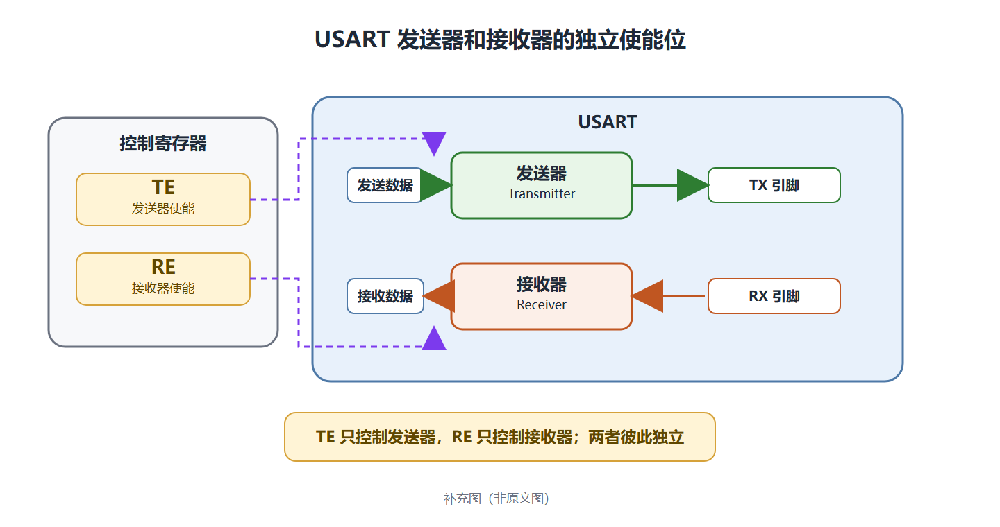

# README 写作规范

## 1. 适用范围

本规范用于编写和维护外设学习笔记类 `README.md`。当前样本为 `UART / USART 学习笔记`，后续章节应沿用相同的结构、语气和格式。

本文规定 README 的内容组织和 Markdown 写法。图片的绘制、命名和导出要求另见 [README作图规范.md](README作图规范.md)。

## 2. 写作目标

README 应同时满足以下目标：

- 按参考手册原文顺序完整翻译，不改变原文含义，也不省略条件、步骤、例外和备注。
- 以中文为主，保留重要英文术语，便于对照英文手册。
- 面向初学者，用清楚的中文、分段和原文已有的列表降低阅读难度。
- 每个结论都能追溯到中英文参考手册中的具体章节和页码。
- 长章节和讲解图默认可折叠，避免页面过长。

## 3. 文档整体结构

文档开头只保留一个一级标题：

```markdown
# UART / USART 学习笔记
```

参考手册中的每个小节使用一个独立的 `<details>` 折叠块。章节之后可以继续添加“学习问题”折叠块。

推荐顺序如下：

1. 文档一级标题。
2. 按原文顺序排列的章节折叠块。
3. 与前述章节直接相关的学习问题折叠块。

不要打乱参考手册的章节顺序，也不要把多个原文小节合并到同一个折叠块中。

## 4. 标准章节结构

每个章节使用统一的折叠结构，并在正文后列出参考位置：

```markdown
<details>
<summary>27.x 章节标题</summary>

按原文顺序翻译本节内容，保留原文小标题、段落、步骤、项目符号、备注和图表。

### 参考位置

- 英文参考手册第 27 章，第 27.x 节，印刷页 xxx
- 中文参考手册对应第 25 章，第 25.x 节，印刷页 xxx

</details>
```

## 5. 章节正文写作规则

章节正文以参考手册的完整中文译文为准，不再用摘取“主要要点”的方式代替原文。

- 按原文出现顺序翻译；原文的小标题、段落、编号步骤、项目符号、备注、图题和表格应一一保留。
- 原文中的条件、触发时机、清除方法、异常情况和例外不得因压缩篇幅而省略。
- 可以调整中文语序和断句以便阅读，但不能把不同原文条目合并成一条概括性结论。
- 保留协议名、信号名、寄存器字段名、数值和单位。
- `USART`、`UART`、`TX`、`RX`、`DMA`、`NRZ`、`LIN`、`IrDA`、`CTS`、`RTS`、`TE`、`RE` 等缩写保持英文和原有大小写。
- 数值和单位采用规范写法，例如 `4.5 Mbit/s`、`8 位`、`13 位断开符`。
- 原文没有说明的原因、示例、操作步骤和结论，不写入章节正文。
- 需要补充解释的内容放入单独的“学习问题”。

原文使用项目符号或编号步骤的地方，译文沿用相同列表形式；原文是段落的地方，译文也优先使用段落。中文句子以中文句号结尾。

## 6. 中英文对照规则

正文以完整中文译文为主，只标出有助于查阅英文手册的关键词或关键短语。

英文原文统一使用橙色：

```html
<span style="color:#D9822B;">full-duplex data exchange</span>
```

推荐写法：

```markdown
- 支持全双工数据交换（<span style="color:#D9822B;">full-duplex data exchange</span>）。
```

具体要求：

- 英文短语放在对应中文之后的全角括号内。
- 当用户要求“加翻译”时，必须在对应中文文字后直接添加全角括号，并在括号内写英文翻译。
- 当用户要求“原文翻译”时，应翻译英文手册当前小节的全部正文；这一要求不等同于只给某个术语补英文，也不要求在每句中文后重复完整英文句子。
- 英文内容应与参考手册原文一致，不自行改写成新的英文句子。
- 保留原文中的大小写、连字符和专业术语。
- 不必给每句话都附英文，只保留关键术语和容易产生歧义的短语。
- 信号名、字段名和编码可直接使用反引号，例如 `TX`、`RX`、`Mark`、`Space`。

## 7. “参考位置”写作规则

每个原文章节必须同时列出英文手册和中文手册的位置：

```markdown
### 参考位置

- 英文参考手册第 27 章，第 27.2 节，印刷页 787
- 中文参考手册对应第 25 章，第 25.2 节，印刷页 516
```

注意事项：

- 章节号和页码必须实际核对，不能根据前后章节推测。
- 使用印刷页码，不使用 PDF 阅读器显示的文件页序号，除非明确写成“PDF 页”。
- 中英文手册章节编号不一致时分别记录，不强行统一。
- 一个折叠块只记录当前小节的参考位置。

## 8. 章节内图片与折叠规则

图片应紧跟它所解释的项目符号。章节正文中的讲解图统一使用嵌套 `<details>`，默认折叠。

标准写法如下：

```markdown
- 发送器和接收器具有独立的使能位（<span style="color:#D9822B;">separate enable bits for Transmitter and Receiver</span>）。

  <details>
  <summary><span style="color:#D9822B;">查看发送器和接收器独立使能位示意图</span></summary>

  

  </details>
```

格式要求：

- 嵌套在项目符号下的 `<details>`、`<summary>` 和图片行统一缩进两个空格。
- `<summary>` 使用“查看……示意图”格式，并用橙色显示。
- `<details>`、`<summary>`、图片引用之间保留空行，保证 GitHub 正确渲染。
- 图片替代文本应准确说明图的内容，不使用“图片 1”“如下图”等无意义名称。
- 新增图片统一放在 `image/` 目录，README 使用相对路径引用。
- 图片文件名、draw.io 源文件和图面规范遵循 `README作图规范.md`。
- 删除一张图时，必须同时检查并处理 Markdown 引用、PNG 和对应的 `.drawio` 源文件。

“学习问题”本身已经是折叠块，其中的图片可以直接显示，不需要再套一层 `<details>`。

## 9. 学习问题写作规则

章节中出现需要单独解释的基础概念时，在所有原文章节之后添加学习问题：

```markdown
<details>
<summary>学习问题：什么是全双工？</summary>

先用一至两句话给出直接定义。

- 要点 1。
- 要点 2。
- 要点 3。


必要时在结尾补充注意事项。

</details>
```

学习问题应满足：

- 一个折叠块只回答一个问题。
- 标题使用“学习问题：……”格式。
- 开头先直接回答问题，再展开要点。
- 只解释当前章节理解所必需的知识，不扩展成无关教程。
- 容易混淆的条件、例外或电平差异放在结尾，以“注意：”开头。
- 如果内容已经在章节中解释清楚，不重复建立学习问题。

## 10. Markdown 和排版规则

- 一级标题只用于文档标题。
- 章节内部使用三级标题，不额外插入二级标题。
- 中文正文使用全角标点。
- 中文与英文缩写、阿拉伯数字之间保留自然空格，例如 `使用 DMA 传输`、`配置为 8 位`。
- 术语、信号名和字段名使用反引号，重点结论可少量使用 `**粗体**`。
- 不使用连续多个空行制造间距。
- 不使用本地绝对路径引用图片。
- 不在图片前后重复写与图面标题完全相同的可见图注。
- 所有 HTML 标签必须成对闭合，特别是嵌套的 `<details>`。

## 11. 内容边界

必须明确区分以下两类内容：

| 内容类型 | 放置位置 | 写作要求 |
| --- | --- | --- |
| 参考手册原文及其完整译文 | 章节正文 | 按原文顺序保留结构、条件和例外，可追溯 |
| 基础概念的教学解释 | 学习问题 | 单题单答，服务当前章节 |

不得把个人推断写成手册结论，也不得为了“讲得更多”添加未经资料支持的寄存器值、时序或硬件行为。

## 12. 发布前检查清单

每次新增或修改章节后，至少检查以下项目：

- 章节号、标题和原文顺序是否正确。
- 原文的小标题、段落、步骤、项目符号、备注和图表是否在译文中完整对应。
- 条件、异常情形、清除方式及时间限制是否没有遗漏。
- “参考位置”是否齐全，并且位于章节正文之后。
- 关键英文短语是否来自原文，并使用统一的橙色格式。
- 数值、单位、协议名、信号名和大小写是否准确。
- 中英文手册章节号和印刷页码是否已核对。
- 所有 `<details>` 和 `<summary>` 是否正确闭合。
- 章节内图片是否默认折叠，缩进和空行是否正确。
- 每个图片相对路径是否存在，文件名大小写是否完全一致。
- PNG 是否与同名 `.drawio` 源文件保持一致。
- 是否存在已经删除图片的残留引用或没有被引用的临时图片。
- GitHub 预览中标题、列表、折叠块和图片是否正常显示。

## 13. 最小可复制模板

```markdown
<details>
<summary>27.x 章节标题</summary>

本节第一段的完整中文翻译（<span style="color:#D9822B;">English phrase</span>）。

### 原文小标题 / 中文翻译

原文第二段的完整中文翻译。

1. 原文步骤 1 的中文翻译。
2. 原文步骤 2 的中文翻译。

注意：原文备注的中文翻译。

- 原文图题或表题对应的中文说明。

  <details>
  <summary><span style="color:#D9822B;">查看相关示意图</span></summary>

  

  </details>

### 参考位置

- 英文参考手册第 xx 章，第 xx.x 节，印刷页 xxx
- 中文参考手册对应第 xx 章，第 xx.x 节，印刷页 xxx

</details>
```
