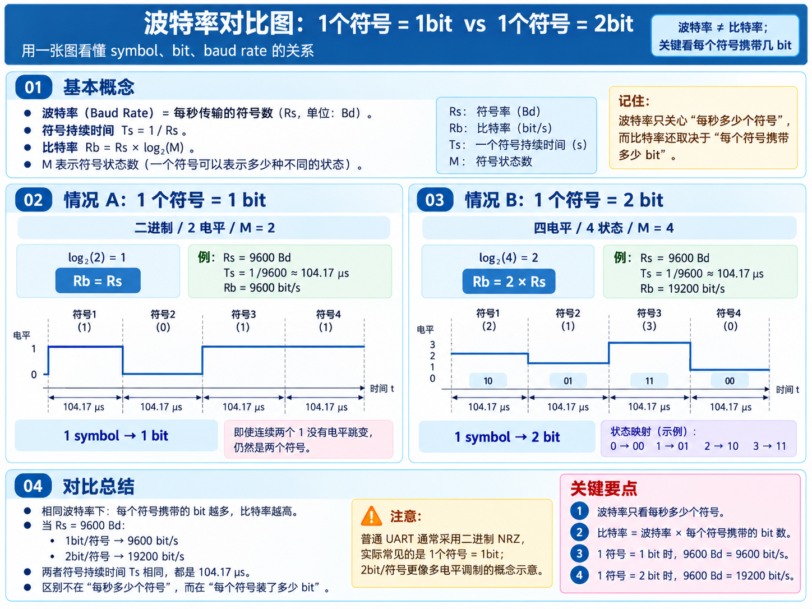

# 波特率对比图：1个符号 = 1bit vs 1个符号 = 2bit

## 核心概念

- 波特率（Baud Rate）表示每秒传输的符号数，单位为 `Bd`。
- 符号持续时间：`Ts = 1 / Rs`。
- 比特率：`Rb = Rs × log₂(M)`，其中 `M` 是符号状态数。
- 波特率只关心每秒传输多少个符号；比特率还取决于每个符号携带多少 bit。

## 两种情况对比

| 情况 | 符号状态 | 每个符号携带 | 比特率关系 |
| --- | --- | --- | --- |
| A | 二进制，`M = 2` | 1 bit | `Rb = Rs` |
| B | 四电平，`M = 4` | 2 bit | `Rb = 2 × Rs` |

以 `Rs = 9600 Bd` 为例：

- 1 个符号 = 1 bit：`Rb = 9600 bit/s`。
- 1 个符号 = 2 bit：`Rb = 19200 bit/s`。
- 两种情况下符号持续时间相同，均为 `Ts ≈ 104.17 μs`。

## 结论

相同波特率下，每个符号携带的 bit 越多，比特率越高。普通 UART 通常采用二进制 NRZ，一个符号通常对应 1 bit。
